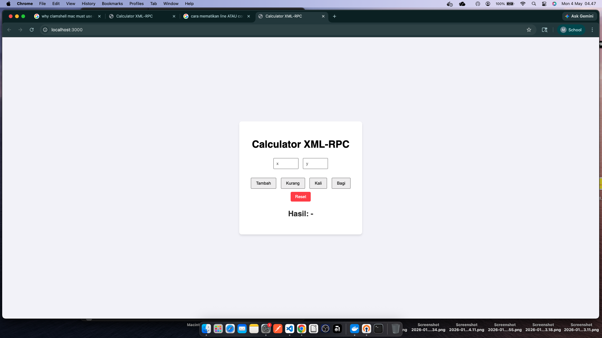

# JobSheet 4 

# Documentation
These Jobsheet contained about XML RPC ( REMOTE PROCEDURE CALL)
What is XML RPC ?
"It is a data communication technique between applications that uses the HTTP protocol and procedures with return values that work across different platforms. Because of this, XML-RPC is a solid alternative for building client-server applications.

In practice, messages sent via XML-RPC are essentially HTTP-POST requests where the request body is formatted as XML. The parameters sent through XML-RPC can include scalars, numbers, strings, dates, objects, lists, arrays, and more. Below is a simple example of an XML-RPC request format."

What's in Project :

        Tech Stack :
            - Java Lang
            - Docker yaml
            - Node.js
            - JavaScript

Simple App to use for Practicing
Web-Based Calculator

For Documentation and Code Scripts :
    Documentation and Assigment Report :
        [Docs](Scripts/)
    For Scirpts :
        [Files](Scripts/jobsheet4_Muhammad-Raafi43325803.pdf)

# Getting Started
To run these project, 
minimum requirement:
must have installed docker desktop(Mac/Win), and docker cli (Linux)
then :

        Run these commands :
            docker compose build
            docker compose up -d

Open browser and access port 3000

# Summary

