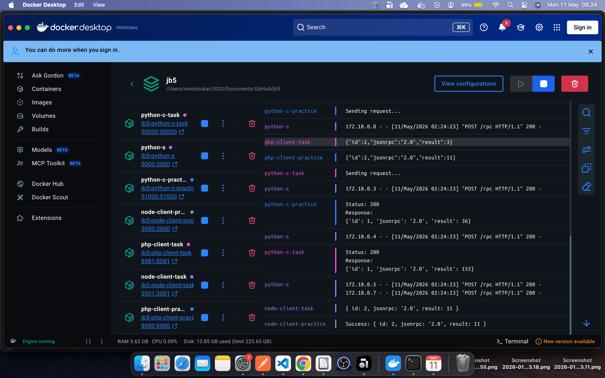

# JobSheet 5

# Documentation
These Jobsheet contained about JSON-RPC ( REMOTE PROCEDURE CALL)
What is JSON-RPC ?
" protocol of Remote Procedure Call (RPC) used JSON to encoding data. "
Transport: HTTP atau WebSocket.
Tipe komunikasi:
🔁 Request-Response → client sent request, server answer result.
⬆️ Notification → client sent message without waiting response.

What's in Project :

        Tech Stack :
            - Python
            - Docker yaml
            - Node.js
            - PHP 8

these result of practicing and solve task of assignment from jobsheet

For Documentation and Code Scripts :
    Documentation and Assigment Report :
        [Docs](docs/jobsheet5_Muhammad-Raafi43325803.pdf)
    For Scirpts :
        [Files](scripts/)

# Getting Started
To run these project, 
minimum requirement:
must have installed docker desktop(Mac/Win), and docker cli (Linux)
then run commands below :

            docker compose build
            docker compose up -d

for result test use docker container/ accessing by terminal to look response inside of docker container

# Summary

