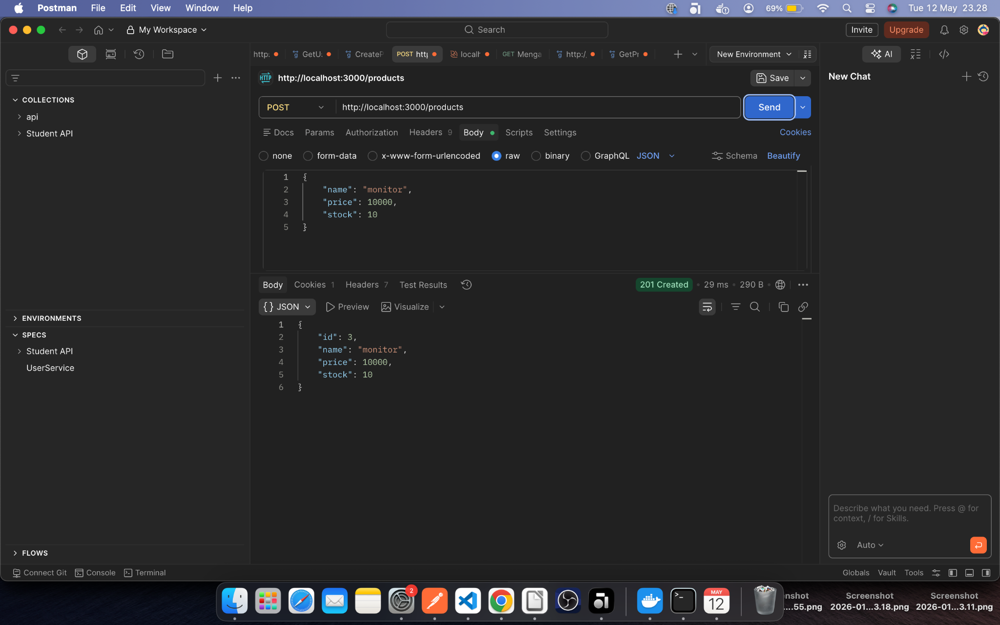
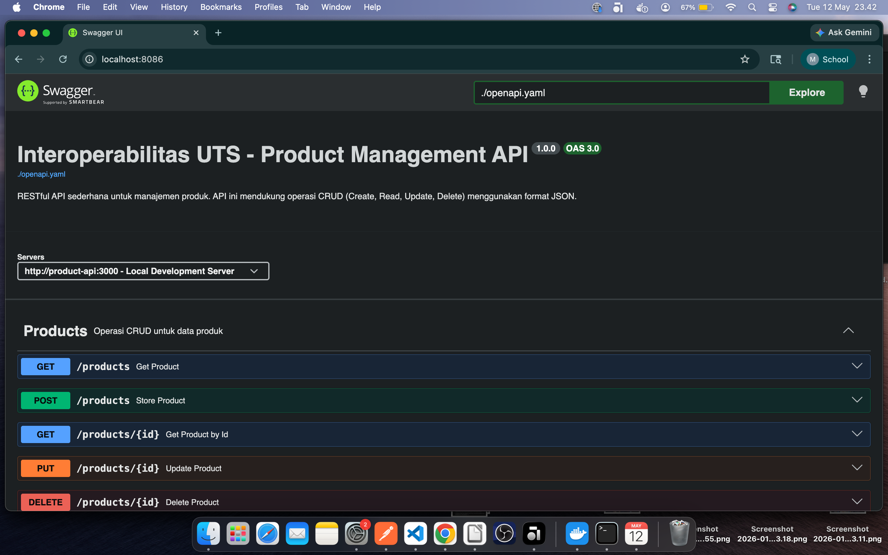
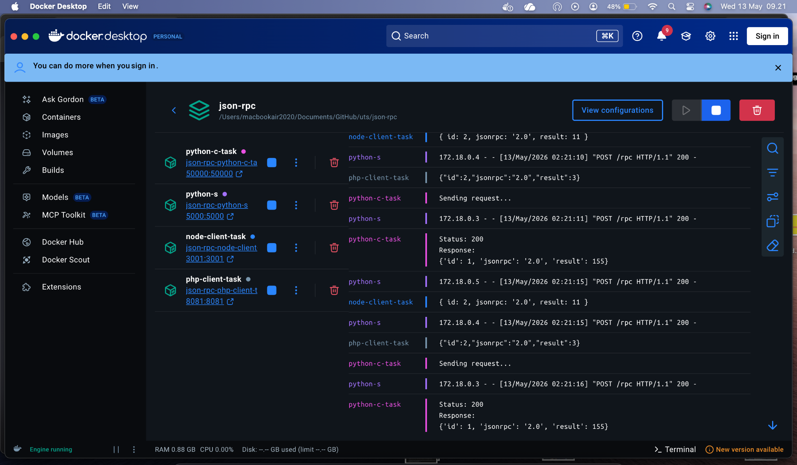
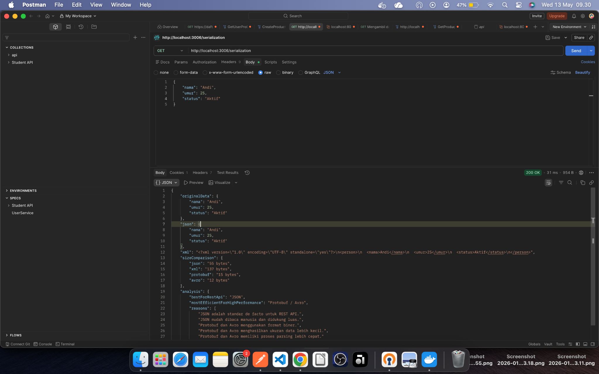
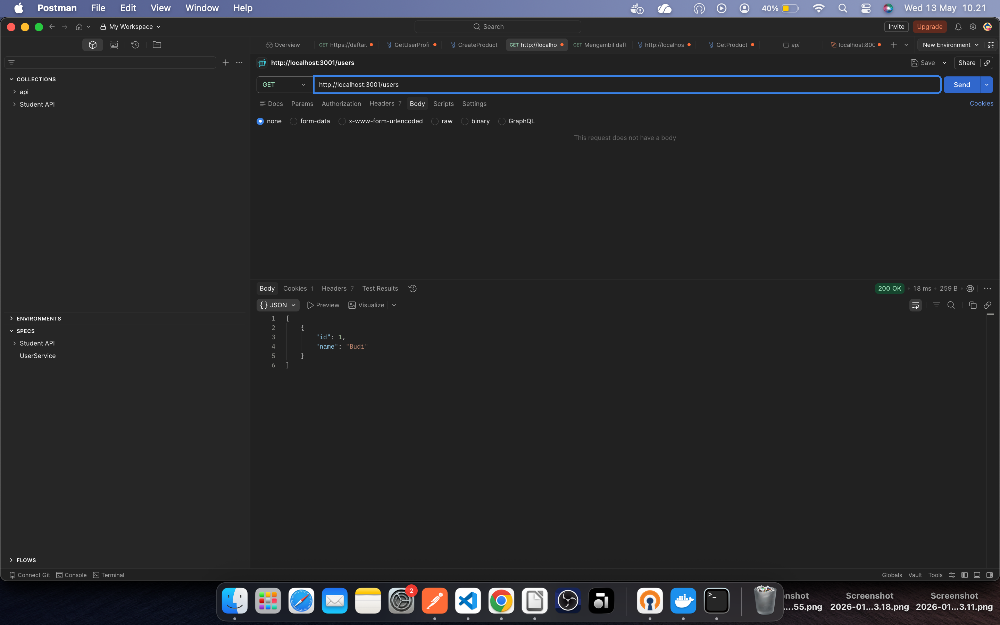
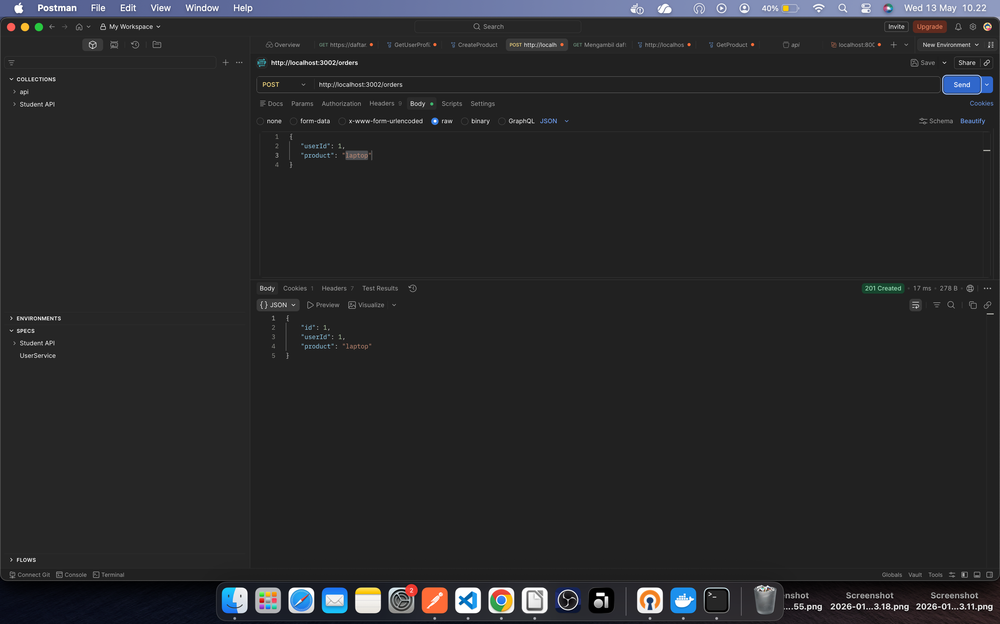
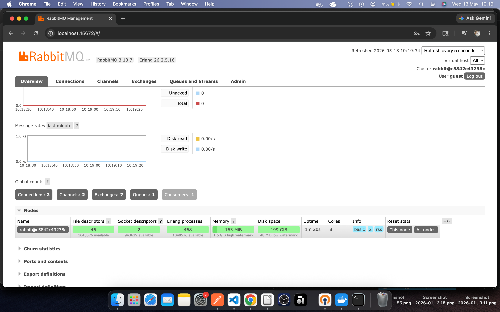
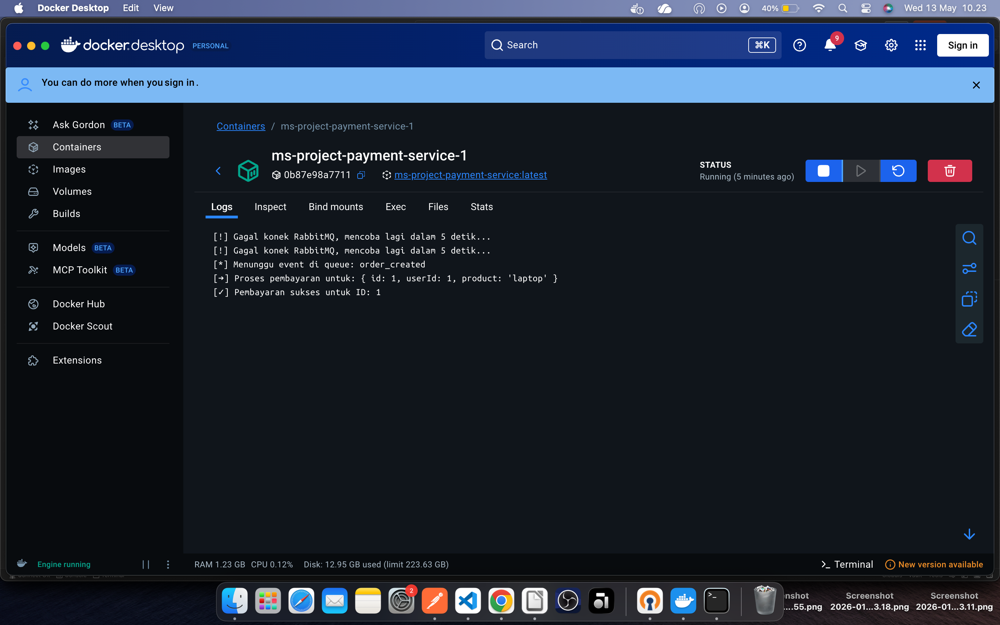

# Mid-Semester-Test

# List of Content

1.  [Documentation ](https://github.com/ra4fi433/Interpobability_TI-3D-RPL/tree/main/uts#documentation)
2.  [File Report ](https://github.com/ra4fi433/Interpobability_TI-3D-RPL/blob/main/uts/docs/uts_43325803-M_Raafi_h.pdf)
3.  [Getting Started ](https://github.com/ra4fi433/Interpobability_TI-3D-RPL/tree/main/uts#getting-started)

# Documentation

For these semester about Interoperabilities, 

in middle semester do test about course in 7th weeks, 

there is all of courses

    - Rest API
    - Open API
    - JSON RPC
    - Data Serilization
    - Microservices and Event-Driven Architecture

to read summary and document report :
[Report File](docs/uts_43325803-M_Raafi_h.pdf)

and there is segmentation of each courses Scripts

# Rest API and Open API

To applies concept of Rest API and API documentation with OPEN-API

for script : 

[rest api](RESTful-API/server.js)

[openapi](openapi/openapi.yaml)

Sample of Result :

# JSON-RPC

To applies Request and Response with JSON-RPC concept

for scripts :

Server of RPC

[server of rpc](json-rpc/server/server.py)

Client of RPC

[python](json-rpc/client/python-c/client.py)

[Node.Js](json-rpc/client/node/client.js)

[PHP](json-rpc/client/php/client.php)

Sample of Result :

# Data Serialization 

To proof and compare about JSON and XML convertion Response of API

for script :

[Data Serilization](data_serilization/data-s.js)

Sample of Result :

# Microservices and Event-Driven Architecture

To Applies how service running with concept of Microservice and Event-Driven Architechture

for scripts :

[microservice and Event-Driven Architecture](microservice/)

Sample of Result :

# Getting Started

all of these scripts is controlled by Docker, 

and to run it make sure docker desktop or docker cli have already installed in machine, 

to run these scripts, write and run these commands in terminal :

        docker compose build --no-cache
        docker compose up -d

exception only for [microservice](https://github.com/ra4fi433/Interpobability_TI-3D-RPL/tree/main/uts#microservices-and-event-driven-architecture)

use separated docker-compose.yaml file caused focus and specific purposes

